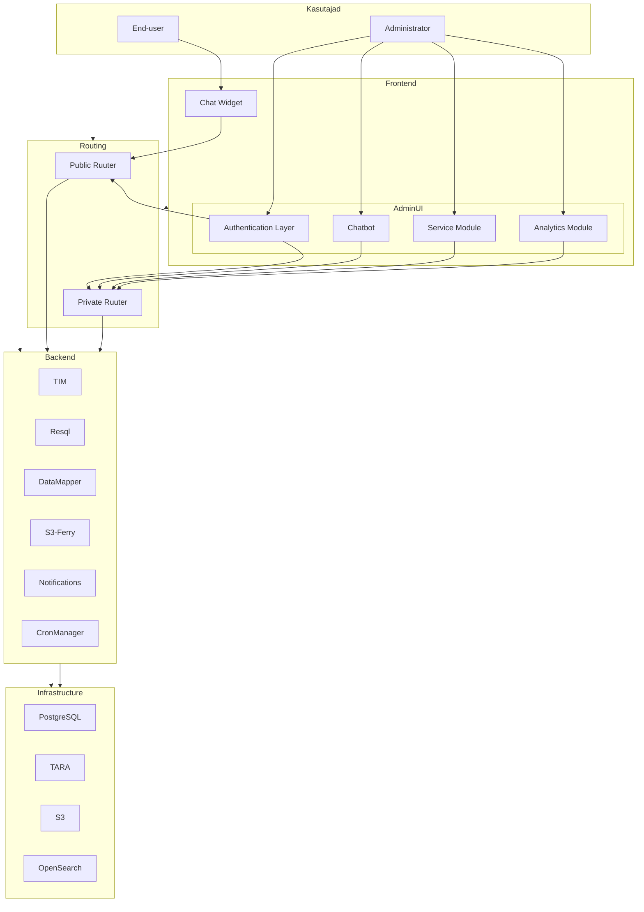

# High-Level Architecture

## Purpose

This document provides a high-level overview of the Bürokratt platform architecture.

Its purpose is to explain the main architectural building blocks, their responsibilities, and how they interact. This document is intended as an entry point for developers, architects, and technical stakeholders who need to understand the overall system before exploring individual repositories or implementation details.

---

## Scope

This document covers:

- Major platform components
- Logical communication between architectural layers
- Responsibilities of each layer
- Core architectural principles

This document intentionally does **not** cover:

- Detailed implementation of individual services
- API specifications
- Runtime request flows
- Deployment topology
- Kubernetes or Docker configuration
- Database schemas

Those topics are documented separately.

---

## High-Level Architecture

---

## Architecture Overview

The Bürokratt platform is composed of multiple independent backend services orchestrated through dedicated routing components.

The platform separates public-facing traffic from administrator-facing traffic by using two independent Ruuter instances:

- **Public Ruuter** handles requests originating from external clients such as the Chat Widget and public authentication flows.
- **Private Ruuter** handles authenticated administrator-facing workflows originating from the administration applications.

Frontend applications never communicate directly with backend services. All requests are routed through the appropriate Ruuter instance.

Backend components are designed as isolated capabilities. Each component is responsible for a specific technical function, while workflow orchestration remains the responsibility of the Ruuter.

---

## Architectural Layers

### Users

Represents end-users interacting with the public chatbot as well as administrators managing the platform.

### Frontend

Contains user-facing applications, including the Chat Widget and administrator modules.

### Routing

The routing layer orchestrates business workflows and coordinates communication between frontend applications and backend services.

The routing layer is the central integration point of the platform.

### Backend

Backend services implement specific technical capabilities such as authentication, database access, data transformation, scheduled execution, notifications and file handling.

Backend services do not orchestrate workflows and do not communicate directly with each other.

### Infrastructure

Shared platform resources such as databases, object storage and external identity providers.

---

## Architectural Principles

The Bürokratt platform follows several core architectural principles:

- All business workflows are orchestrated through Public or Private Ruuter.
- Backend services are isolated and independently deployable.
- Backend services never invoke each other directly.
- Business logic resides within routing configurations rather than backend services.
- Frontend applications communicate only with the routing layer.
- Infrastructure services are consumed only by the backend components that require them.

---

## Component Responsibilities

| Component | Responsibility |
|-----------|----------------|
| Public Ruuter | Entry point for public-facing requests and workflow orchestration. |
| Private Ruuter | Entry point for administrator-facing workflows. |
| TIM | Authentication and authorization services. |
| Resql | SQL execution layer exposed through REST APIs. |
| DataMapper | Data transformation using Handlebars templates and helper functions. |
| S3-Ferry | Object storage and file management. |
| Notification Server | Notification delivery. |
| CronManager | Scheduled workflow execution. |

---

## Related Documentation

- Repository Overview
- Platform Components
- Runtime Flows
- Deployment Architecture
- Architecture Decision Records
