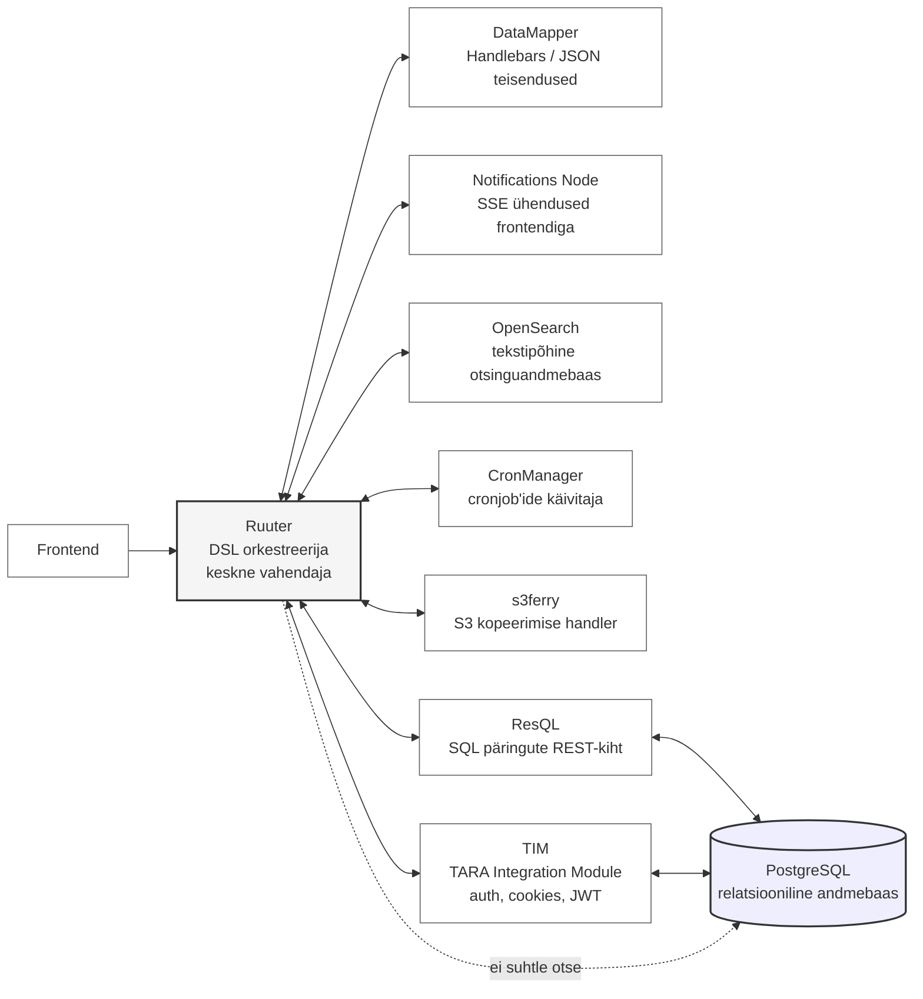

### Byckstack arhidektuur

**Backend arhitektuur**

Bürokrati rakenduskiht on ehitatud keskse vahendaja (central mediator) põhimõttel.  
Frontend ei suhtle otse alamkomponentide ega andmebaasidega, vaid teeb kõik päringud `Ruuteri` kaudu.  

`Ruuter` on süsteemi keskne orkestreerija, mis juhib DSL-põhiseid töövooge ning vahendab liiklust teiste stacki komponentidega.

Andmebaasidele ligipääs on rangelt piiratud. PostgreSQL-andmebaasidega suhtlevad ainult selleks ettenähtud komponendid:

- `ResQL`, mis vastutab SQL-päringute käivitamise eest
- `TIM`, mis haldab TARA-põhist autentimist ning sellega seotud küpsiseid ja tokeneid

Stackis on **eraldatud andmebaasid** ning TIM suhtleb ainult oma andmebaasiga.

Ülejäänud komponendid — DataMapper, Notifications Node, OpenSearch, CronManager ja s3ferry — suhtlevad ainult Ruuteriga ning neil puudub otsene ligipääs:

- teistele komponentidele
- andmebaasidele
- frontendile

Frontend **ei tee kunagi päringuid** otse ühegi komponendi suunas, vältides Ruuterit.

