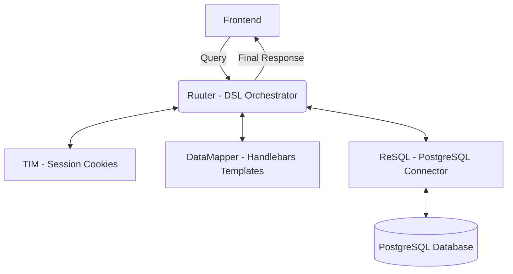
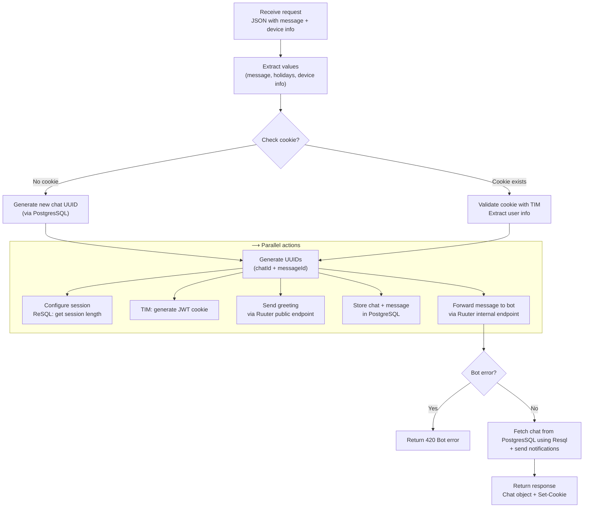

## Example:

### **Chat Request Flow - init.yml**

### 1. Receive Request
- Endpoint accepts JSON (`message` + `user/device` info).

### 2. Extract Values
- Pull key fields from the request:
  - message content  
  - holidays  
  - device info  

### 3. Check Cookie (Session)
- **If no cookie** → generate new chat UUID.  
- **If cookie exists** → validate it with TIM and extract user info.  

### 4. Generate UUIDs (via Resql and PostgresSQL)
- Always generate:
  - Chat ID  
  - Message ID  

### 5. Configure Session
- Ask **ReSQL** for session length.  
- Use **TIM** to generate a **JWT cookie** with that chat ID.  

### 6. Send Greetings
- Trigger greeting message through a **Ruuter** public endpoint.  

### 7. Store Chat + Message in PostgresSQL (via ReSQL)
- Insert the user’s first message.  
- Create a new chat record (**status: OPEN**).  

### 8. Forward to Bot
- Send the message + holiday data to the bot.  
- **If bot fails** → return `"Bot error"` with status **420**.  

### 9. Fetch Chat & Notify
- Get chat details from **PostgresSQL** using **ReSQL**.  
- Send notifications (chat + message).

### 10. Return Response
- Reply with the chat object.  
- Attach **Set-Cookie** header for the new/validated session. 

 
