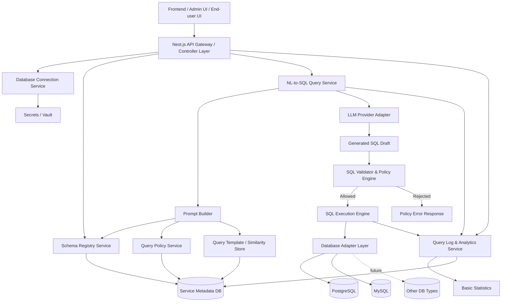
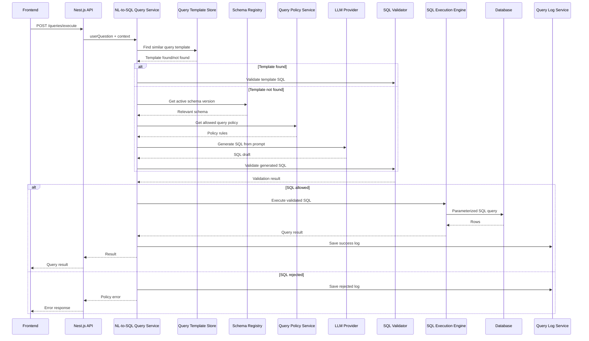

# SQL Middle Layer

## 1. Overview

The goal of this project is to build a **Nest.js-based SQL orchestration microservice** that enables SQL queries to be generated, validated, and executed against different databases based on end-user natural language questions.

The purpose of the service is to act as a backend middle-layer, on top of which both an admin interface and an end-user interface can later be built.

Service roles:

- translate the user’s natural language question into a SQL query;
- store and manage database connection configurations;
- import, describe, and version database schemas;
- provide controlled context to the LLM for SQL generation;
- validate generated SQL against allowed rules;
- execute only allowed queries;
- log the user question, generated SQL, parameters, and execution metadata;
- enable similar queries to be reused as templates in the future.

Important constraint:

> The LLM must never execute a query directly against the database.  
> The LLM only provides a SQL candidate. The system validates, restricts, parameterizes, and only then executes it.

---

## 2. High-level architecture



Note: authentication and administrator access are assumed to be handled in an external admin interface or a separate service. This is not treated as an internal component of this SQL middle-layer service.

---

## 3. Main components

## 3.1 API Layer

Nest.js controllers and DTOs.

Example endpoints:

```http
POST /connections
GET /connections
POST /schemas/import
GET /schemas
GET /schemas/:id
POST /schemas/:id/clone
POST /queries/generate
POST /queries/execute
GET /query-logs
GET /statistics
```

The API layer should not generate or execute SQL itself. It routes the work to the appropriate services.

API layer responsibilities:

- DTO validation of inputs;
- exposing endpoints;
- routing requests to the correct service;
- returning a standardized response/error format;
- passing the user context provided by the external admin interface to downstream services.

---

## 3.2 Database Connection Service

Manages database connections.

Supported databases in the first phase:

```ts
enum DatabaseType {
  POSTGRESQL = 'postgresql',
  MYSQL = 'mysql',
}
```

The configuration could include:

```ts
{
  id: string;
  name: string;
  type: 'postgresql' | 'mysql';
  host: string;
  port: number;
  database: string;
  username: string;
  secretRef: string;
  sslEnabled: boolean;
  isActive: boolean;
}
```

Passwords should not be stored directly in the main table. They could go into a secrets manager, vault, or at least a separate encrypted storage.

Example configuration in JSON format:

```json
{
  "id": "conn_01",
  "name": "Production PostgreSQL",
  "type": "postgresql",
  "host": "db.example.internal",
  "port": 5432,
  "database": "main_app",
  "username": "readonly_user",
  "secretRef": "vault://sql-middle-layer/prod/postgres/password",
  "sslEnabled": true,
  "isActive": true
}
```

Connection Service responsibilities:

- creating connection configurations;
- modifying connections;
- deactivating connections;
- testing connections;
- selecting the appropriate DB adapter;
- using the secret reference to read the password.

---

## 3.3 Database Adapter Layer

The adapter layer makes it easy to add databases.

```ts
interface DatabaseAdapter {
  testConnection(config: DbConnectionConfig): Promise<boolean>;

  introspectSchema(config: DbConnectionConfig): Promise<ImportedSchema>;

  executeQuery(
    config: DbConnectionConfig,
    query: ValidatedSqlQuery,
    params?: Record<string, unknown>
  ): Promise<QueryResult>;
}
```

Initial adapters:

```txt
PostgreSqlAdapter
MySqlAdapter
```

Future additions:

```txt
MsSqlAdapter
OracleAdapter
SnowflakeAdapter
BigQueryAdapter
```

The goal of the adapter layer is to hide the specifics of a particular database from the rest of the system.

For example, PostgreSQL and MySQL schema introspection differ technically, but Schema Registry Service should receive a unified `ImportedSchema` object in both cases.

---

## 3.4 Schema Registry Service

Stores schemas with versioning.

Important principle:

> Modifying a schema does not overwrite the existing schema, but creates a new version.

Example:

```ts
{
  id: string;
  connectionId: string;
  name: string;
  version: number;
  source: 'imported' | 'manual' | 'edited';
  status: 'draft' | 'active' | 'archived';
  schemaDefinition: {
    tables: TableDefinition[];
    relations: RelationDefinition[];
    descriptions?: Record<string, string>;
  };
  createdAt: Date;
}
```

The schema could include not only tables and columns, but also descriptions that the LLM can use more effectively.

Example:

```json
{
  "table": "benefits",
  "description": "Benefits assigned to the user",
  "columns": [
    {
      "name": "user_id",
      "type": "integer",
      "description": "Unique user ID"
    },
    {
      "name": "amount",
      "type": "decimal",
      "description": "Benefit amount in euros"
    },
    {
      "name": "status",
      "type": "varchar",
      "description": "Benefit status, for example active or inactive"
    },
    {
      "name": "valid_from",
      "type": "date",
      "description": "Start of the benefit validity period"
    },
    {
      "name": "valid_to",
      "type": "date",
      "description": "End of the benefit validity period"
    }
  ]
}
```

Schema versioning example:

```txt
schema: benefits-schema
version 1: imported from the database
version 2: administrator added column descriptions
version 3: administrator clarified the table description
```

By default, only the active schema version should be provided to the LLM, not all historical versions.

---

## 3.5 Query Policy Service

Validates which queries are allowed.

Principle:

> Everything that is not allowed is forbidden.

Example policy:

```json
{
  "allowedStatements": ["SELECT"],
  "blockedStatements": ["INSERT", "UPDATE", "DELETE", "DROP", "ALTER"],
  "allowedSchemas": ["public"],
  "allowedTables": ["benefits", "users"],
  "maxRows": 1000,
  "requireLimit": true,
  "allowJoins": true,
  "allowSubqueries": false
}
```

If the LLM generates, for example:

```sql
DELETE FROM benefits WHERE user_id = 2;
```

then the validator returns an error:

```json
{
  "error": "QUERY_NOT_ALLOWED",
  "message": "Only SELECT queries are allowed."
}
```

Policy Service could later support different levels:

```txt
Global policy
Connection policy
Schema policy
Table policy
Use-case specific policy
```

In the MVP, a connection/schema-level policy is probably sufficient.

---

## 3.6 NL-to-SQL Query Service

Responsible for converting the user’s question into a SQL query.

Workflow:

1. the user asks a question;
2. the appropriate database connection and schema are found;
3. the system checks whether a similar query pattern already exists;
4. the LLM prompt is built;
5. the LLM generates SQL;
6. the SQL is validated;
7. the allowed query is executed;
8. the result and the entire process are logged.

Example:

The user asks:

```txt
How much benefit do I receive?
```

The LLM is not given unlimited information about the whole system, but controlled context:

```txt
User question:
How much benefit do I receive?

Allowed SQL:
SELECT only

Relevant schema:
Table: benefits
Columns:
- user_id integer
- amount decimal
- status varchar
- valid_from date
- valid_to date

Current user:
user_id = 2

Generate parameterized SQL only.
```

The LLM could return:

```sql
SELECT amount
FROM benefits
WHERE user_id = :userId
  AND status = 'active'
LIMIT 100;
```

Not:

```sql
SELECT * FROM benefits WHERE user_id = 2;
```

**Parameterized SQL** is preferred, because query patterns can then be reused more safely later.

---

## 3.7 Prompt Builder

Prompt Builder creates a limited and controlled input for the LLM.

The prompt should not include the entire database if it is not necessary. Instead, only the relevant schema portion, rules, and user context should be provided.

Example prompt:

```txt
You are an SQL generation assistant.

Generate SQL only.
Do not explain.
Use parameterized SQL.
Only SELECT queries are allowed.
Always include LIMIT.

User question:
How much benefit do I receive?

Current user context:
userId = 2

Relevant database schema:
Table: benefits
Description: Benefits assigned to the user

Columns:
- user_id integer: Unique user ID
- amount decimal: Benefit amount in euros
- status varchar: Benefit status
- valid_from date: Start of validity
- valid_to date: End of validity

Return JSON:
{
  "sql": "...",
  "params": {
    "userId": 2
  }
}
```

Possible LLM response:

```json
{
  "sql": "SELECT amount FROM benefits WHERE user_id = :userId AND status = 'active' LIMIT 100;",
  "params": {
    "userId": 2
  }
}
```

---

## 3.8 LLM Provider Adapter

LLM Provider Adapter hides the technical integration of the specific LLM service from the rest of the system.

```ts
interface LlmProvider {
  generateSql(prompt: string): Promise<LlmSqlResponse>;
}
```

Example response type:

```ts
interface LlmSqlResponse {
  sql: string;
  params?: Record<string, unknown>;
  model?: string;
  tokenUsage?: {
    inputTokens: number;
    outputTokens: number;
  };
}
```

Initially there may be one provider, but the architecture should allow adding the following later:

```txt
OpenAI provider
Azure OpenAI provider
Local LLM provider
Other hosted LLM provider
```

In the MVP, multiple providers do not need to be managed from the UI, but the abstraction should exist in the code.

---

## 3.9 SQL Validator & Policy Engine

This is a critical security layer.

The validator should check at least:

- whether the SQL is syntactically correct;
- whether the statement type is allowed;
- whether only allowed tables are used;
- whether only allowed schemas are used;
- whether forbidden commands are absent;
- whether LIMIT is present if required;
- whether the query is read-only;
- whether multiple statements are not sent at once;
- whether raw user input is not inserted directly into the SQL string.

Recommendation: SQL should be parsed into an AST, not checked only with string matches.

Example of an allowed query:

```sql
SELECT amount
FROM benefits
WHERE user_id = :userId
LIMIT 100;
```

Example of a forbidden query:

```sql
UPDATE benefits
SET amount = 0
WHERE user_id = :userId;
```

Example of a forbidden multi-statement query:

```sql
SELECT amount FROM benefits WHERE user_id = :userId;
DROP TABLE benefits;
```

Possible validator response:

```json
{
  "isAllowed": false,
  "reason": "MULTI_STATEMENT_NOT_ALLOWED",
  "message": "Only a single SELECT statement is allowed."
}
```

---

## 3.10 SQL Execution Engine

Executes only validated queries.

Recommended restrictions:

- query timeout;
- max rows;
- read-only transaction;
- connection pool;
- audit logging;
- error sanitization;
- rate limiting.

Execution Engine should not trust LLM output even if the prompt says to generate only SELECT.

Example internal execution request:

```ts
{
  connectionId: 'conn_01',
  schemaVersionId: 'schema_03',
  sql: 'SELECT amount FROM benefits WHERE user_id = :userId AND status = :status LIMIT 100;',
  params: {
    userId: 2,
    status: 'active'
  }
}
```

Example execution response:

```json
{
  "rows": [
    {
      "amount": 250.00
    }
  ],
  "rowCount": 1,
  "executionTimeMs": 42
}
```

---

## 3.11 Query Log & Template Store

Every query process should be logged.

Example:

```ts
{
  id: string;
  userQuestion: string;
  generatedSql: string;
  parameterizedSql: string;
  parameters: Record<string, unknown>;
  connectionId: string;
  schemaVersionId: string;
  validationStatus: 'allowed' | 'rejected';
  executionStatus: 'success' | 'failed' | 'not_executed';
  executionTimeMs: number;
  rowCount: number;
  createdAt: Date;
}
```

Later, a template can be built from this:

```sql
SELECT amount
FROM benefits
WHERE user_id = :userId
  AND status = 'active'
LIMIT 100;
```

If the next user asks the same thing, the LLM does not always need to generate new SQL. The system can find a similar question and use the existing template with new parameters.

Example:

```txt
Previous question:
How much benefit do I receive?

Saved template:
SELECT amount FROM benefits WHERE user_id = :userId AND status = 'active' LIMIT 100;

New user:
userId = 3

Executable query:
SELECT amount FROM benefits WHERE user_id = :userId AND status = 'active' LIMIT 100;
params: { userId: 3 }
```

In the MVP, template matching can be simple. For example, the system can initially only log queries and later add similarity search / embedding-based search.

---

## 3.12 Basic Statistics Service

Basic statistics could include:

- number of queries;
- number of successful queries;
- number of rejected queries;
- average execution time;
- most used schemas;
- most used tables;
- top user questions;
- error rate.

Example response:

```json
{
  "totalQueries": 1250,
  "successfulQueries": 1130,
  "rejectedQueries": 80,
  "failedQueries": 40,
  "averageExecutionTimeMs": 58,
  "topTables": [
    {
      "table": "benefits",
      "count": 640
    }
  ]
}
```

---

## 4. Sequence diagram – from user question to SQL result



---

## 5. Recommended internal module structure in Nest.js

```txt
src/
  app.module.ts

  connections/
    connections.module.ts
    connections.controller.ts
    connections.service.ts
    adapters/
      database-adapter.interface.ts
      postgres.adapter.ts
      mysql.adapter.ts

  schemas/
    schemas.module.ts
    schemas.controller.ts
    schemas.service.ts
    schema-versioning.service.ts

  query/
    query.module.ts
    query.controller.ts
    query.service.ts
    prompt-builder.service.ts
    llm-provider.interface.ts
    openai-llm.provider.ts

  validation/
    validation.module.ts
    sql-validator.service.ts
    policy-engine.service.ts

  execution/
    execution.module.ts
    execution.service.ts

  logs/
    logs.module.ts
    logs.service.ts
    statistics.service.ts

  common/
    errors/
    dto/
    config/
```

---

## 6. First-version MVP scope

The MVP could include:

1. Adding PostgreSQL and MySQL connections.
2. Testing connections.
3. Importing schema from the database.
4. Adding schema manually.
5. Schema versioning.
6. Generating SELECT queries via LLM.
7. SQL policy: only SELECT allowed.
8. LIMIT requirement.
9. Query validation.
10. Query execution.
11. Query logging.
12. Basic statistics.
13. Basic tests.

The following could be left out of the MVP:

- complex semantic search for query templates;
- management of multiple LLM providers;
- complex data masking;
- advanced row-level permission mapping;
- detailed UI schema editor;
- cross-db queries spanning multiple databases.

---

## 7. Core test packages

Minimum required tests:

### Connection tests

- PostgreSQL connection succeeds/fails;
- MySQL connection succeeds/fails.

### Schema tests

- schema import works;
- manual schema creation works;
- editing a schema creates a new version.

### Policy tests

- SELECT allowed;
- INSERT rejected;
- UPDATE rejected;
- DELETE rejected;
- DROP rejected;
- query without LIMIT rejected if LIMIT is required.

### Execution tests

- valid query executes;
- invalid query never executes;
- timeout works;
- max row limit works.

### Logging tests

- generated query is logged;
- rejected query is logged;
- execution metadata is saved.

---

## 8. Short architectural summary

The backend could be a **Nest.js-based SQL orchestration microservice**, whose core consists of five larger parts:

1. Connection Management
2. Schema Registry & Versioning
3. NL-to-SQL Generation
4. SQL Validation & Policy Enforcement
5. Execution, Logging & Analytics

The most important architectural rule:

> The LLM must never execute a query directly against the database.  
> The LLM only provides a SQL candidate. The system validates, restricts, parameterizes, and only then executes it.
