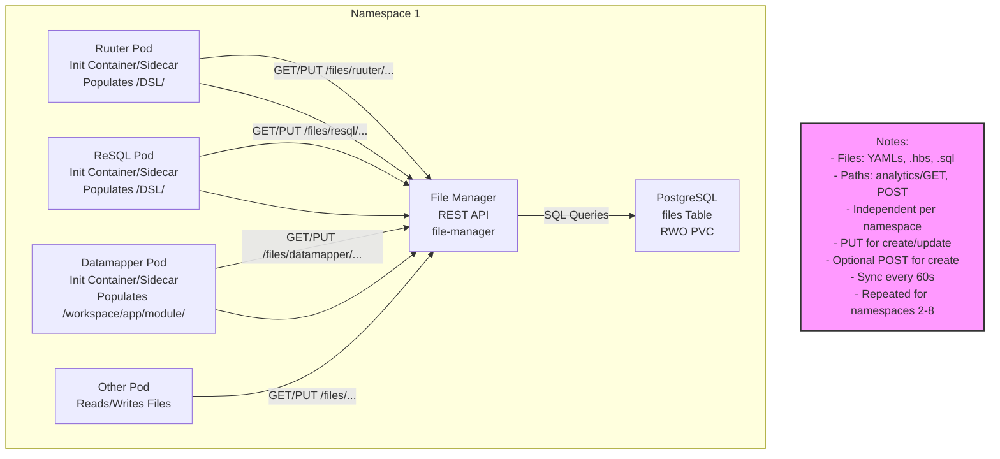

```mermaid
graph TD
    Frontend[Frontend<br>GET /get-fie]
    subgraph Namespace1[Namespace 1]
        RuuterPod[Ruuter Pod<br>/DSL/analytics/GET/file.yml<br>emptyDir]
        ReSQLPod[ReSQL Pod<br>/DSL/analytics/POST/file.sql<br>emptyDir]
        DatamapperPod[Datamapper Pod<br>/workspace/app/module/analytics/template.hbs<br>emptyDir]
        OtherPod[Other Pod<br>Reads/Writes Files]
        FileManager[File Manager<br>REST API<br>file-manager]
        Postgres[PostgreSQL<br>files Table<br>RWO PVC]
    end

    %% Flow
    Frontend -->|GET /get-fie| RuuterPod
    RuuterPod -->|Reads /DSL/analytics/GET/file.yml| RuuterPod

    %% File Manager Interactions
    RuuterPod -->|GET/PUT /files/ruuter/...| FileManager
    ReSQLPod -->|GET/PUT /files/resql/...| FileManager
    DatamapperPod -->|GET/PUT /files/datamapper/...| FileManager
    OtherPod -->|GET/PUT /files/...| FileManager
    FileManager -->|SQL Queries| Postgres

    %% File Population
    RuuterPod[Ruuter Pod<br>Init Container/Sidecar<br>Populates /DSL/] --> FileManager
    ReSQLPod[ReSQL Pod<br>Init Container/Sidecar<br>Populates /DSL/] --> FileManager
    DatamapperPod[Datamapper Pod<br>Init Container/Sidecar<br>Populates /workspace/app/module/] --> FileManager

    %% Notes
    classDef note fill:#f9f,stroke:#333,stroke-width:2px;
    Note[Notes:<br>- Files: YAMLs, .hbs, .sql<br>- Paths: analytics/GET, POST<br>- Independent namespace<br>- Pods: emptyDir, no RWO<br>- Postgres: RWO PVC<br>- PUT for create/update<br>- Optional POST for create<br>- Sync every 60s<br>- Repeated for namespaces 2-8]:::note
